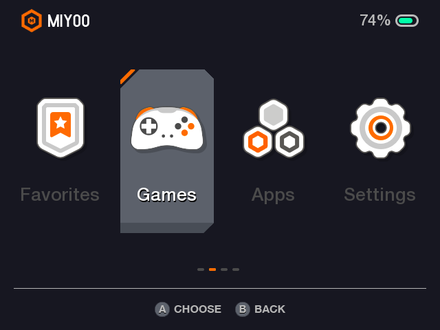
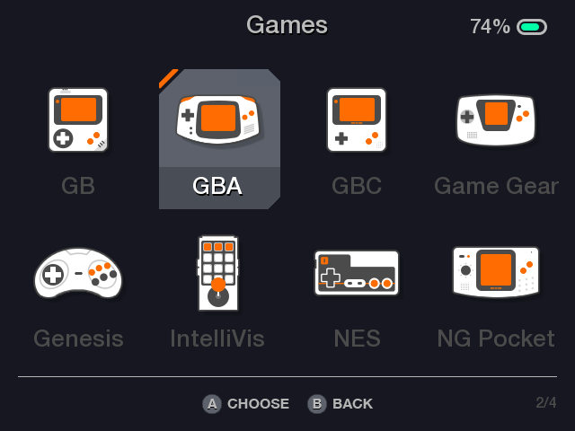
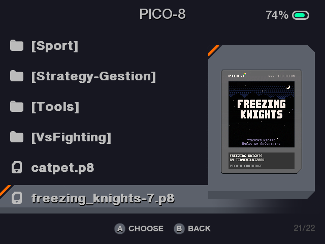
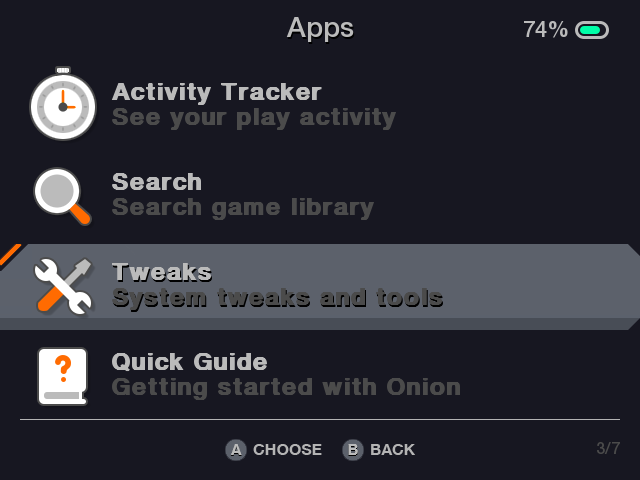
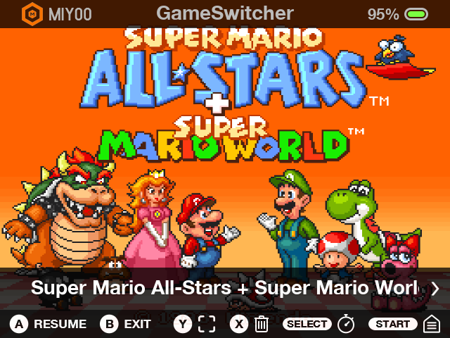
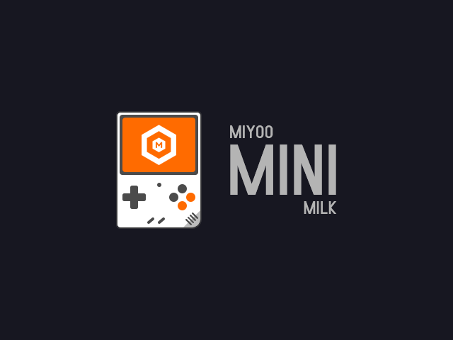

&nbsp;

#

**A simple edit of Segich's gorgeous [Milk White theme](https://github.com/SergeiBabko/miyoo-mini-milk-theme), giving dark backgrounds to the theme to make it easier on the eyes in dark rooms.**

## SCREENSHOTS

    
    
    
    
    
    
    
    
    
    
    
    

## SAY THANKS

**If you're feeling generous and love this theme, support Segich! His work is beautiful and he has a Kofi link on the [original repo.](https://github.com/SergeiBabko/miyoo-mini-milk-theme)**
